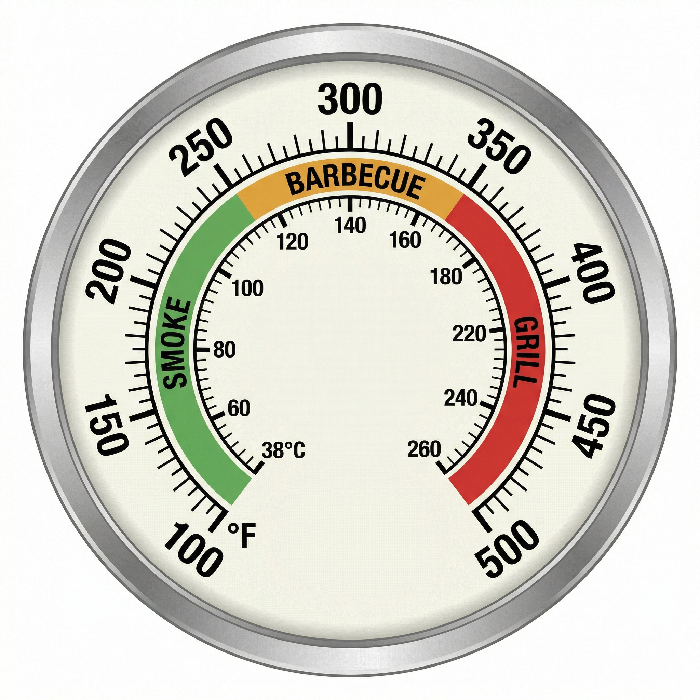

# The Complete Temperature Guide

Everything you need to know about cooking temperatures in one place — from the zone on your thermometer to the internal temp of your meat and how long it takes to get there.

---

## Part 1: Know Your Temperature Zones

Understanding temperature zones is the single most important skill in kamado and BBQ cooking. The same grill that cold-smokes salmon at 80°F can sear a steak at 750°F — but only if you know which zone to use and why.

{ width="400" }

### Smoke Zone — 100–225°F (38–107°C)

This is **low-and-slow** territory. At these temperatures, wood and charcoal produce thin, clean blue smoke that gently penetrates the meat over hours. Collagen breaks down into gelatin, tough connective tissues soften, and fat renders slowly — producing the tender, pull-apart texture that defines great barbecue.

**Best for:**

- Brisket (225°F, 10–14 hours)
- Pork shoulder / pulled pork (225°F, 8–12 hours)
- Ribs (225°F, 5–6 hours)
- Smoked salmon (120–150°F, 3–4 hours)
- Beef cheeks, chuck roasts, and other tough cuts

**Tips:**

- Keep the smoke thin and blue — thick white smoke means incomplete combustion and bitter flavour.
- A water pan helps stabilise temperature and adds moisture.
- Don't rush it. Time is your main ingredient in this zone.

### Barbecue Zone — 225–350°F (107–177°C)

The **sweet spot** for most outdoor cooking. This range gives you enough heat to develop colour and bark on the outside while still cooking gently enough for the inside to reach doneness without drying out. Many pitmasters refer to the 250–275°F range as the "competition zone" for brisket and ribs.

The upper end (300–350°F) is sometimes called **hot-and-fast** — a method gaining popularity for producing excellent results in roughly half the time of traditional low-and-slow.

**Best for:**

- Whole chickens and turkeys (325–350°F)
- Bone-in chicken thighs and drumsticks (300–325°F)
- Sausages and hot dogs (275–325°F)
- Pork loin and tenderloin (325–350°F)
- Roast vegetables and potatoes (325–350°F)
- Baking bread, pizza dough, and casseroles (325–350°F)

### Grill Zone — 350–500°F+ (177–260°C+)

This is **direct, high-heat cooking** — the zone for searing, charring, and fast grilling. At these temperatures, the Maillard reaction kicks into high gear, creating that caramelised crust and complex flavour on the surface of your food.

A kamado like the Big Green Egg can push well beyond 500°F — up to **750°F** for steakhouse-quality searing.

**Best for:**

- Steaks (450–500°F+, 2–4 minutes per side)
- Burgers (400–450°F, 3–4 minutes per side)
- Fish steaks and seafood (400–450°F)
- Pizza (500–700°F, 2–3 minutes)
- Chicken breasts (400–450°F)
- Vegetables and fruit (400–450°F, quick char)

**Tips:**

- Preheat fully before placing food on the grate.
- For thick steaks, consider the **reverse sear**: start low (225–250°F) until 10–15°F below target internal temp, then sear over high heat for the crust.
- Keep the lid closed as much as possible — opening it drops temperature fast.

---

## Part 2: Low & Slow vs Hot & Fast

| | Low & Slow (225–275°F) | Hot & Fast (300–350°F) |
|---|---|---|
| **Time** | Longer (often 1–1.5 hrs/lb) | Roughly half the time |
| **Smoke flavour** | Deeper, more pronounced | Milder, lighter |
| **Bark** | Thinner, darker | Thicker, crunchier |
| **Best cuts** | Large, collagen-heavy (brisket, pork butt) | Smaller cuts, ribs, chicken |
| **Texture** | Maximum tenderness and render | Firmer slice, still tender |

Both methods produce excellent results — choose based on your cut and your schedule.

---

## Part 3: The Full Kamado Range

| Temperature | Zone | Cooking Style | Examples |
|---|---|---|---|
| 80–120°F (27–49°C) | Cold smoke | Smoking without cooking | Cheese, salmon, bacon |
| 120–180°F (49–82°C) | Warm smoke | Dehydrating, jerky | Beef jerky, dried fruits |
| 200–250°F (93–121°C) | Low & slow | Traditional barbecue | Brisket, pulled pork, ribs |
| 250–350°F (121–177°C) | Roast / bake | Roasting, baking, hot & fast | Whole chicken, bread, casseroles |
| 350–450°F (177–232°C) | Grill | Direct grilling | Steaks, burgers, chops, fish |
| 450–500°F (232–260°C) | High grill | Fast sear, charring | Thin steaks, vegetables, flatbreads |
| 500–750°F (260–400°C) | Inferno | Pizza, steakhouse sear | Neapolitan pizza, reverse sear finish |

---

## Part 4: Internal Meat Temperatures

Knowing your grill temperature is only half the equation. You also need to know when the meat itself is done. Always verify with a reliable instant-read thermometer.

{ width="500" }

### Doneness by Internal Temperature

| Doneness | Temp (°F) | Temp (°C) |
|---|---|---|
| Rare | 120–125°F | 48–52°C |
| Medium-rare | 130–135°F | 54–57°C |
| Medium | 140–145°F | 58–60°C |
| Medium-well | 150–155°F | 63–65°C |
| Well done | 160°F+ | 68–72°C |
| Pulled / shreddable | 205°F | 90–95°C |

### Target Temperatures by Meat

| Meat | Cut | Target Temp |
|---|---|---|
| **Beef** | Steak (medium-rare) | 130–135°F / 54–57°C |
| **Beef** | Roast (medium) | 140–145°F / 58–60°C |
| **Beef** | Brisket (pulled) | 205°F / 96°C |
| **Beef** | Ground | 160°F / 71°C |
| **Pork** | Loin / chops | 145°F / 63°C |
| **Pork** | Shoulder / pulled | 205°F / 96°C |
| **Pork** | Ground | 160°F / 71°C |
| **Pork** | Ham | 160°F / 71°C |
| **Chicken** | White meat | 165°F / 74°C |
| **Chicken** | Dark meat | 175°F / 79°C |
| **Turkey** | Whole | 165°F / 74°C |
| **Lamb** | Leg / rack (medium) | 145°F / 63°C |
| **Lamb** | Shoulder (pulled) | 205°F / 96°C |
| **Fish** | Cooked through | 145°F / 63°C |
| **Venison** | Loin (medium) | 140°F / 58–60°C |
| **Duck** | Whole | 165–175°F / 75–80°C |

### Smoking Woods by Meat

| Meat | Recommended Woods |
|---|---|
| **Beef** | Cherry, Hickory, Mesquite, Oak, Pecan, Walnut |
| **Pork** | Alder, Apple, Cherry, Hickory, Lilac, Maple, Mesquite, Mulberry, Oak, Orange, Peach, Pear, Pecan, Plum, Walnut |
| **Poultry** | Alder, Apple, Cherry, Hickory, Lilac, Maple, Mulberry, Oak, Orange, Peach, Pear, Pecan, Plum |
| **Lamb** | Apple, Cherry, Mulberry, Oak |
| **Fish** | Alder, Apple, Lilac, Maple, Mulberry, Oak, Plum |

---

## Part 5: Roasting Times

> **Use as a planning guide only — always verify with a thermometer.**

### Time Per Weight

| Meat | Time per kg | Time per lb |
|---|---|---|
| Beef (roast) | 45–60 min/kg | 20–27 min/lb |
| Lamb (leg) | 45–60 min/kg | 20–27 min/lb |
| Pork (loin) | 50–60 min/kg | 23–27 min/lb |
| Chicken (whole) | 45–50 min/kg | 20–23 min/lb |
| Turkey (whole) | 40–45 min/kg | 18–20 min/lb |

### Roasting Temperatures by Cut

| Meat | Cut | Oven / Egg Temp | Rare | Medium | Well Done |
|---|---|---|---|---|---|
| Beef | Rib roast / Sirloin | 350°F / 180°C | 48–52°C | 58–60°C | 68–70°C |
| Beef | Eye of round | 350°F / 180°C | — | 60–63°C | 70–72°C |
| Lamb | Leg (bone-in) | 350°F / 180°C | 50–52°C | 58–60°C | 68–70°C |
| Lamb | Shoulder | 320°F / 160°C (slow) | — | — | 90–95°C |
| Pork | Loin roast | 350°F / 180°C | — | 63–65°C | 70°C |
| Pork | Shoulder / Butt | 320°F / 160°C (slow) | — | — | 90–95°C |
| Chicken | Whole bird | 350°F / 180°C | — | — | 74–75°C |
| Chicken | Thighs / drumsticks | 400°F / 200°C | — | — | 75–80°C |
| Turkey | Whole | 340°F / 170°C | — | — | 74–75°C |
| Duck | Whole | 350°F / 180°C | — | — | 75–80°C |
| Venison | Leg / loin | 350°F / 180°C | 50–52°C | 58–60°C | 65°C |

---

## Part 6: Resting — The Step Most People Skip

Resting allows juices to redistribute through the meat. Cut too early and they run out onto the board instead of staying in the slice.

| Meat | Rest Time |
|---|---|
| Beef / Lamb | 15–30 min |
| Pork | 10–20 min |
| Chicken / Turkey | 10–20 min |

Internal temperature will rise **3–10°F (2–5°C) during resting** — account for this by pulling meat off slightly below your target.

---

## Part 7: Temperature Control on the Egg

The kamado's ceramic walls and adjustable vents make precise temperature control straightforward:

- **Lower temperatures** — Close down both the bottom draft door and top daisy wheel. Less airflow = less combustion = lower heat.
- **Higher temperatures** — Open both vents wider. More air feeds the fire.
- **Steady hold** — Make small adjustments and wait 10–15 minutes between changes. The ceramic holds temperature with remarkable stability.
- **Avoid overshooting** — It's much easier to raise temperature than to bring it down. Creep up to your target gradually.

---

## Part 8: Food Safety

### The Danger Zone — 40–140°F (4–60°C)

Bacteria multiply rapidly in this range. Meat should pass through it as quickly as possible.

- Never leave raw or partially cooked meat in this range for more than **2 hours** (1 hour if ambient temperature is above 90°F).
- Poultry must reach **165°F / 74°C** — no exceptions.
- Pork is safe at **145°F / 63°C + rest**.
- Ground meat of any kind must reach **160°F / 71°C** (bacteria is mixed throughout during grinding).
- Always use a **probe thermometer** — colour is not a reliable indicator of doneness.

---

## Quick Reference Cheat Sheet

### Roasting Tips

- Bring meat to **room temperature** (30–60 min) before cooking
- Season generously with **salt**
- Use a **rack** for even airflow
- Rest uncovered or loosely tented with foil
- Slice **across the grain**

### The Golden Rules

1. **Know your zone** — smoke, barbecue, or grill
2. **Cook to internal temp**, not time alone
3. **Rest your meat** — always
4. **Use a thermometer** — it's your most important tool
5. **Keep the lid closed** — every peek costs heat
